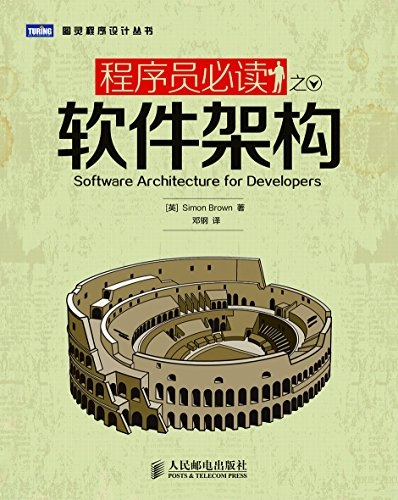

# 软件架构设计

[aws地址](https://www.amazon.cn/dp/B01531761G/ref=sr_1_3?ie=UTF8&qid=1547436018&sr=8-3&keywords=%E8%BD%AF%E4%BB%B6%E6%9E%B6%E6%9E%84%E8%AE%BE%E8%AE%A1)

## 什么是架构 

## 什么是软件架构

### 系统架构

### 应用程序架构

### 软件架构

### 企业架构

## 什么是架构师

## 什么是敏捷

