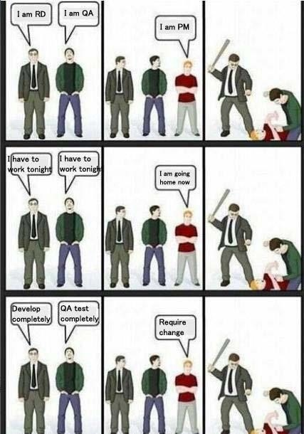
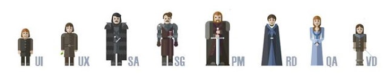

# 角色

## PM

这个是产品经理的意思。我一直以为是项目经理的缩写。太坑爹了，本人还写过一个屌丝文章，看来要贻笑大方了。

## RD

RD是研究与开发（研发）。诸如PHP程序猿，Java程序猿，无论是爱疯的还是安卓的都是属于这一类别。
## FE

FE是前端研发。有点意思！

## UE

UE是用户体验

## QA

QA是测试

## OP
OP是运维

还有DBA,DB,UI,WC这些应该都清楚。

