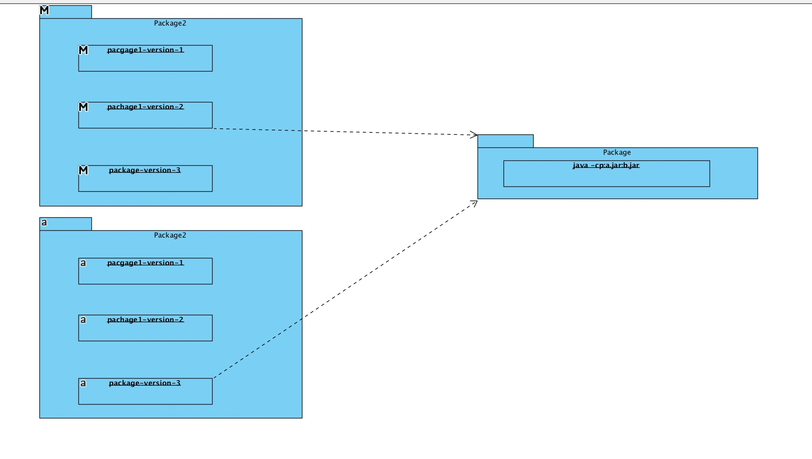

# virtualenv

## 简介

virtualenv 创建隔绝的Python环境的工具,是一个创建隔离无污染的python环境的工具.

这个工具的重要完全是由于py的包版本管理没有maven这么完善导致的,python基于路径,查找依赖,一个路径下不可以多版本并存.每个包直接不一定强制想下兼容,这就导致我们在开发多个项目的时候。会出现不同项目对同一个包的依赖版本不一样，那么我们一般怎么解呢？当然是让依赖跟随项目，这个时候就需要一个这么个工具了。

下面详细介绍这个工具的一些用法和作用。

mavevn 依赖逻辑如下:




## 用法

简单的打印帮助文档如下。

```
Usage: virtualenv [OPTIONS] DEST_DIR

Options:
  --version             show program's version number and exit
  -h, --help            show this help message and exit
  -v, --verbose         Increase verbosity.
  -q, --quiet           Decrease verbosity.
  -p PYTHON_EXE, --python=PYTHON_EXE
                        The Python interpreter to use, e.g.,
                        --python=python3.5 will use the python3.5 interpreter
                        to create the new environment.  The default is the
                        interpreter that virtualenv was installed with
                        (/usr/local/opt/python/bin/python2.7)
  --clear               Clear out the non-root install and start from scratch.
  --no-site-packages    DEPRECATED. Retained only for backward compatibility.
                        Not having access to global site-packages is now the
                        default behavior.
  --system-site-packages
                        Give the virtual environment access to the global
                        site-packages.
  --always-copy         Always copy files rather than symlinking.
  --relocatable         Make an EXISTING virtualenv environment relocatable.
                        This fixes up scripts and makes all .pth files
                        relative.
  --no-setuptools       Do not install setuptools in the new virtualenv.
  --no-pip              Do not install pip in the new virtualenv.
  --no-wheel            Do not install wheel in the new virtualenv.
  --extra-search-dir=DIR
                        Directory to look for setuptools/pip distributions in.
                        This option can be used multiple times.
  --download            Download preinstalled packages from PyPI.
  --no-download, --never-download
                        Do not download preinstalled packages from PyPI.
  --prompt=PROMPT       Provides an alternative prompt prefix for this
                        environment.
  --setuptools          DEPRECATED. Retained only for backward compatibility.
                        This option has no effect.
  --distribute          DEPRECATED. Retained only for backward compatibility.
                        This option has no effect.
  --unzip-setuptools    DEPRECATED.  Retained only for backward compatibility.
                        This option has no effect.
```

嗯，帮助文档简洁明了，但其实主要的作用无非就是一个生命周期。创建和修复.


## 分发

### pip分发

#### 生成依赖文件

```
pip freeze > requirements.txt
```

#### 下载所有的依赖

```
pip download --dest packages --python-version 2   --only-binary=:all: -r requirements.txt  --trusted-host mirrors.aliyun.com
```


```
pip download --dest packages -r requirements.txt  --trusted-host mirrors.aliyun.com
```

#### 平台的设置:

https://www.python.org/dev/peps/pep-0425/

### 整个环境分发

#### copyz整个环境

```
virtualenv --no-site-packages ./el7pynosite
pip install -r requirements.txt
tar -cvzf el7pynosite.tar.gz ./el7pynosite
```

然后 scp down下来 整个文件

传到服务器上 

如果目录一致不需要做任何变化
如果目录不一致可以
修改 
`
vim ./el7pynosite/bin/activate
`

最后改变

```vim
 43 VIRTUAL_ENV="/root/el7pynosite"
 44 export VIRTUAL_ENV
 ```
 
 就可以了
 
 或者 
 
```
virtualenv --relocatable .
```

### 生成rpm包

https://pypi.org/project/rpmvenv/0.11.0/

### virtualenv-clone

https://pypi.org/project/virtualenv-clone/

